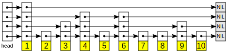

# Learning skip list

Just one of the things I'm learning. <https://github.com/hchiam/learning>

<https://en.wikipedia.org/wiki/Skip_list> -> Basically enable Linked Lists (LL) to use binary search (`O(log n)` time).

Use randomized number of skip pointers and get something like this:

<https://www.reddit.com/r/explainlikeimfive/comments/1jdt67/eli5skip_lists> -> LL, but nodes can have pointers to "skip" faster to find what you're looking for

<https://www.cs.cmu.edu/~ckingsf/bioinfo-lectures/skiplists.pdf> -> you can implement it as a perfect skip list (pointers to exactly 1/2 the items of the previous "level"), but insertions/deletions won't be efficient. But with implementing a randomized number of "skip" pointers per node, you can still get `O(log n)` search times on average _and_ `O(log n)` insertion/deletion times too.
